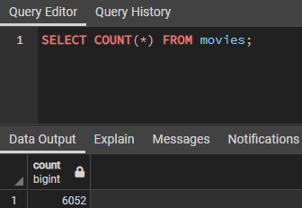

# Movies-ETL Analysis
## Overview of the analysis:
The purpose of this project was to integrate all the extraction, transformation and loading code into one function that takes in the three files—Wikipedia data, Kaggle metadata, and the MovieLens rating data—and performs the ETL process by adding the data to a PostgreSQL database.

## Results:
At first, we tested our extraction function with the three files and used it to clean the Wiki and Kaggle movie files. Once the clean DataFrame were obtained, we added the data to a PostgreSQL database. The resulting tables had the correct number of rows.

## Summary:
Overall, this project improved our ability to generate clean data
